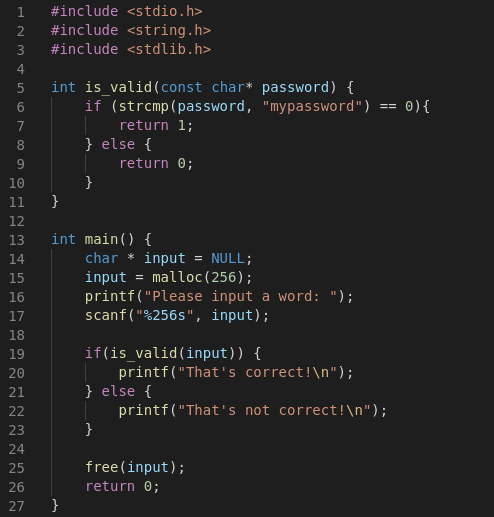
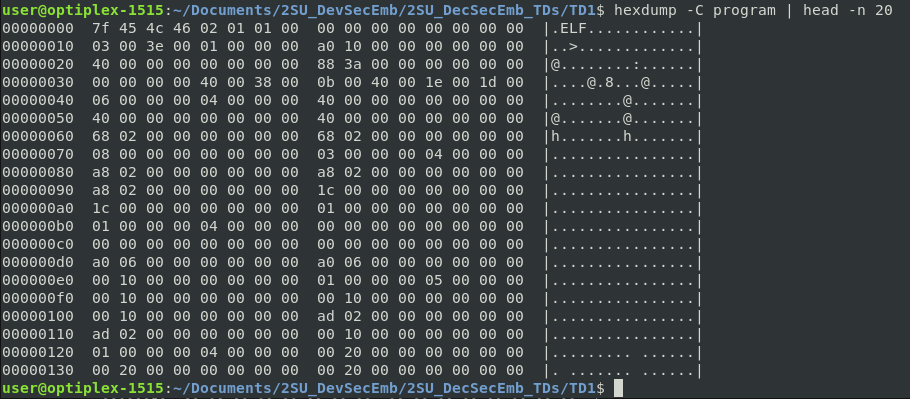
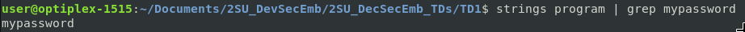
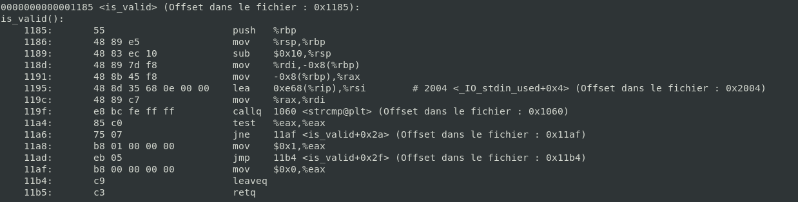
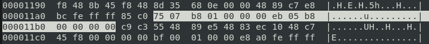
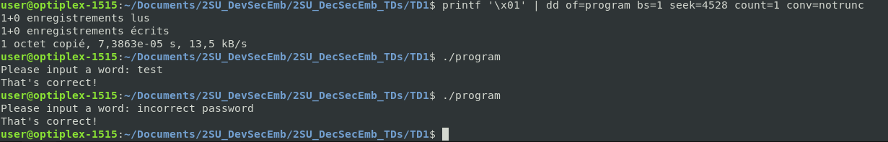

# TD1

## Création du programme

On copie-colle le programme sans oublier de rajouter les bibliothèques tout en haut.

## Analyse du binaire

La commande hexdump permet de visualiser le code binaire généré par la compilation : 

Grâce à la commande string, on peut voir que la valeur du mot de passe (mypassword) est bien présente dans le binaire :

Dans le code désassemblé fourni par objdump, on peut voir la structure d'un if. On voit aussi que dans ce if, différentes valeurs sont mises dans le registre de retour aex. On peut en conclure que si on veut que la fonction "is_valid" retourne tout le temps true (1), il faut modifier le code assembleur pour qu'il mette toujours la valeur 1 dans le registre eax !

Le code machine qui correspond à retourner 1 dans les deux cas est :
`75 07 B8 01 00 00 00 EB 05 B8 01 00 00 00`

# Binary patching

On peut voir que l'octet à modifier est en position 0x11B0 :

On modifie cet octet grâce à la commande dd, et on test le binaire obtenu avec un mot de passe aléatoire. On constate que tout mot de passe est valide :

