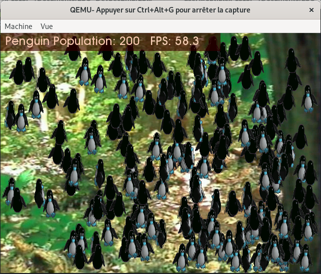

# TD2 - Binwalk

Binwalk est disponible [ici](https://github.com/ReFirmLabs/binwalk)

# Test

On teste l'image avec la commande :

`qemu-system-arm -M versatilepb -m 16 -kernel vmlinuz-qemu-arm-2.6.20 -append "clocksource=pit quiet rw"`

Puis dans le terminal qemu, on utilise la commande :

`run_demo`

Ceci nous donne une crise d'épilepsie : 

# Analyse du binaire

Grâce à [binwalk](https://github.com/ReFirmLabs/binwalk), on peut extraire le contenu du binaire :

`binwalk -C extracted_content -M -e vmlinuz-qemu-arm-2.6.20`

Grâce à la commande tree, on peut visualiser rapidement le contenu du résultat :

`tree extracted_content`

On peut voir que plusieurs images sont présentes ! Dont une qui s'appelle tux.png (notre cher petit Pingouin):

# Modification du contenu

On modifie l'image à la mano, puis on reconstruit l'image binaire de la VM :

`ls | cpio -ov > ../0.cpio`