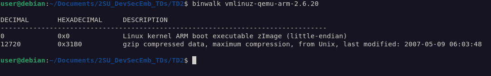
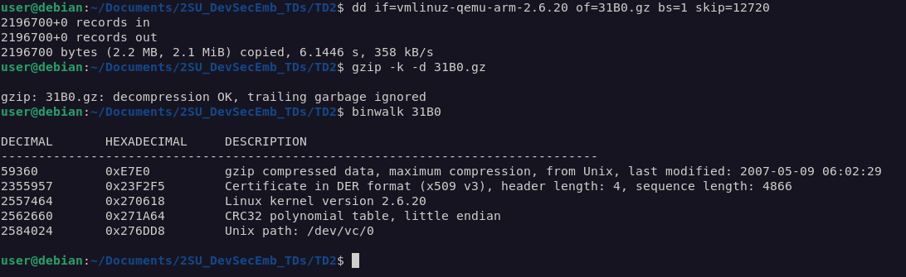
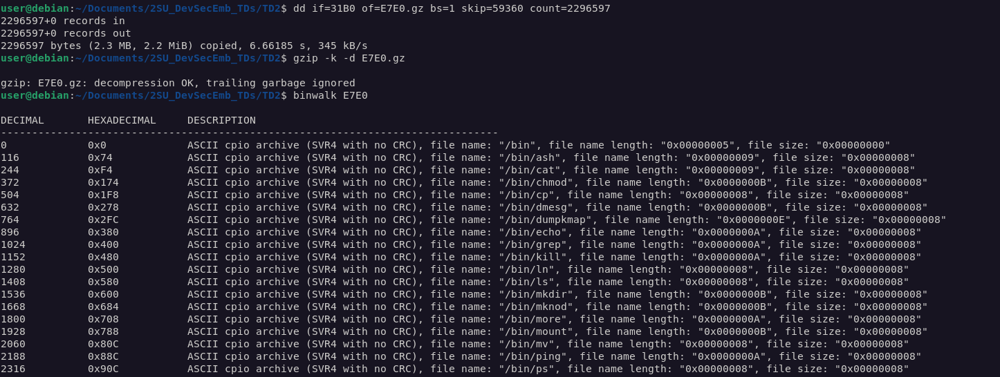
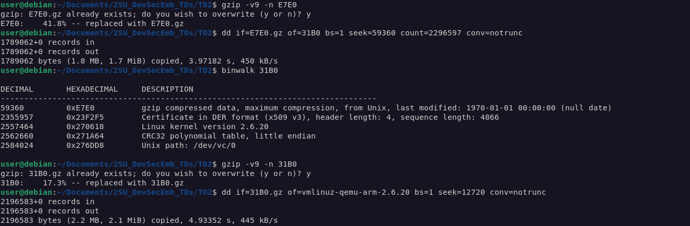

# TD2 - Binwalk

Binwalk est disponible [ici](https://github.com/ReFirmLabs/binwalk)

# Test

On teste l'image avec la commande :

`qemu-system-arm -M versatilepb -m 16 -kernel vmlinuz-qemu-arm-2.6.20 -append "clocksource=pit quiet rw"`

Puis dans le terminal qemu, on utilise la commande :

`run_demo`

Ceci nous donne une crise d'épilepsie : 

# Analyse du binaire

Grâce à [binwalk](https://github.com/ReFirmLabs/binwalk), on peut extraire le contenu du binaire :

`binwalk -C extracted_content -M -e vmlinuz-qemu-arm-2.6.20`

Grâce à la commande tree, on peut visualiser rapidement le contenu du résultat :

`tree extracted_content`

On peut voir que plusieurs images sont présentes ! Dont une qui s'appelle tux.png (notre cher petit Pingouin):

# Modification du contenu

## Méthode 1 (plus de chance de fonctionner)

Grâce à la commande `binwalk vmlinuz-qemu-arm-2.6.20`, on peut voir à partir de quel offset le système de fichier débute.

Ici, l'offset est de 12720 octets. Avec *dd* on récupère le fichier gzip de l'image qui se situe à l'offset. La commande à utiliser est donc :

`dd if=vmlinuz-qemu-arm-2.6.20 of=31B0.gz bs=1 skip=12720`

On peut ensuite décompresser le résultat avec *gzip* puis utiliser binwalk à nouveau.

On voit un autre fichier gzip à la position 59360, pour le récupérer, on refait appel à *dd* de la même manière que précédemment, cette fois-ci il faut préciser le nombre d'octets à récupérer puisque le fichier n'est pas en dernière position :

`dd if=31B0 of=E7E0.gz bs=1 skip=59360 count=2296597`

On peut à nouveau décompresser le résultat et rappeler binwalk :

Dans le résultat de la commande on apperçoit notre fameux pingouin en position 0x2D89DC dans le fichier, grâce à un script python, on peut modifier un bit du fichier tux.png directement.

Il faut ensuite recompresser l'archive CPIO au format gzip, puis la repositionner dans le fichier 31B0. Puis il faut recompresser 31B0 au format gzip et enfin le repositionner dans l'image binaire : 

**ERREUR** : Lorsque je ne modifie pas l'archive CPIO, la reconstruction de l'image semble fonctionner, mais dès que j'y touche ça ne fonctionne plus... Je suppose que le problème vient du fait que je ne désarchive pas l'archive CPIO pour modifier tux.png ? Je vois aussi que lorsque je recompresse mon E7E0, la taille du fichier est bien plus faible que l'originale, pourquoi ?

## Méthode 2 (ne fonctionne pas)
On modifie l'image à la main avec GIMP par exemple, puis on reconstruit l'image binaire de la VM.

Premièrement, on doit reconstruire l'archive CPIO, pour ce faire, on utilise la commande suivante depuis le répertoire cpio_root :

`find . | cpio -o -H newc > ../E7E0`

On compresse ensuite le fichier obtenu en utilisant *gzip* :

`gzip -v9 E7E0`

L'argument v9 permet de préciser que l'on utilise la compression maximale.

Grâce à la commande *dd*, on peut insérer le fichier obtenu dans l'image originale de la VM. Mais d'abord, il faut trouver l'offset auquel le positionner :

`binwalk vmlinuz-qemu-arm-2.6.20`

Puis :

`dd if=E7E0.gz of=vmlinuz-qemu-arm-2.6.20 bs=1 seek=12720`