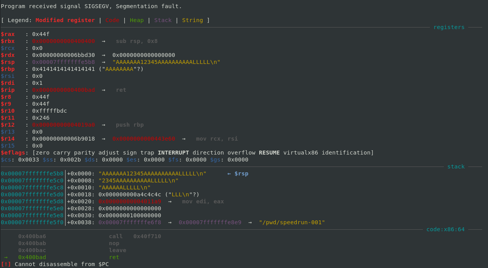
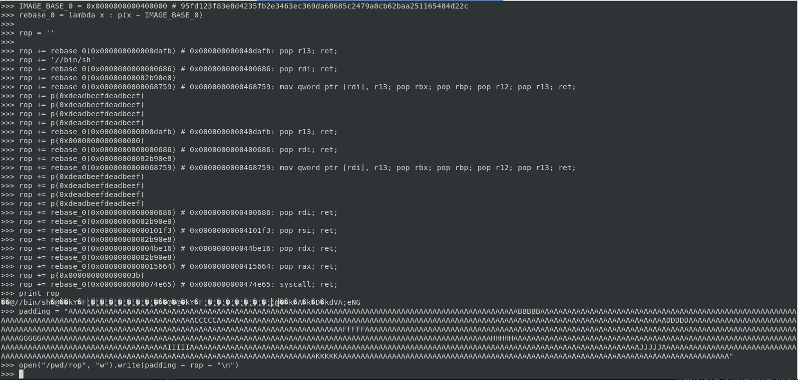
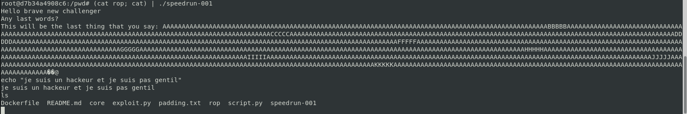

# TD3 - Speedrun

## L'exploit

En donnant une chaine de caractères très longue au programme, on voit qu'une erreur de segmentation se produit.
Étant donné que la protection NX (No Execution) est activée, on ne peut pas directement exécuter des instructions depuis la pile. En revanche, en mettant les bonnes adresses sur la call stack, on peut exécuter des instructions qui sont déjà présentes dans la mémoire de la machine (dans des bibliothèques partagées ou les fonctions du programme par exemple). Avec la bonne suite d'appels, on peut donc exécuter du shell code.

## Mise en place

En exécutant le programme avec gdb, on peut observer la pile. Lors d'un overflow, on peut donc en déduire l'endroit exacte où le buffer à débordé :

J'ai enregistré le buffer extact dans le fichier padding.txt.

Générer un RopChain à la mano est un peu fastidieux, on va donc utiliser l'outil [Ropper](https://github.com/sashs/Ropper) pour générer directement la chaîne à mettre sur la pile d'instructions. Dans le cas présent, on lui demande de nous générer de quoi exécuter un shell avec les droits root, mais on aurait pu lui demander autre chose.

On concatène le résultat obtenu à notre padding, puis on enregistre le tout dans un fichier.

Pour exécuter l'exploit, on utilise la commande :

`$ (cat rop.cve; cat) | ./speedrun-001`

On peut ensuite exécuter des commandes root librement :

En revanche après un certain temps, une sorte de timeout apparaît et le programme se termine.

## Questions 

* Devenez root. Qu'est ce qu'un attaquant peut faire une fois root?

Une fois root, un attaquant peut accéder à, modifier et exécuter n'importe quel fichier du système. Il peut donc voler des informations, surveiller ou falsifier des échanges. 

* Qu'est ce que je dois prendre en compte dans mon modèle d'attaque?

Lors d'une attaque, on doit prendre en compte la surface d'attaque, la criticité du système, les protections mises en place sur la machine ou le programme cible. Dans le cas présent, la protection NX nous a empêchée d'utiliser le buffer overflow afin de mettre du code exécutable directement sur la pile par exemple.

* Comprendre le lien avec les bugs / cette méthode est-elle applicable dans le cas d'un use after free ? Pourquoi ?

Cette attaque a été possible car un bug est présent dans le programme. S'il utilise la fonction scanf par exemple, le programmateur aurait pu s'assurer que la chaîne de caractère entrée ne dépasse pas la taille du buffer (Ex : scanf("%255s", string) permet de limiter l'input à 255 caractères).

* Qu'est ce que je peux faire pour diminuer / contrer les bugs?

On peut utiliser un outil de révision de code qui permet de détecter les bugs facilement les plus fréquents (Ex: Coccinelle etc...), les outils de tests sont aussi très utiles (Ex: Frama C etc...)